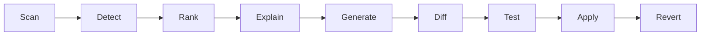
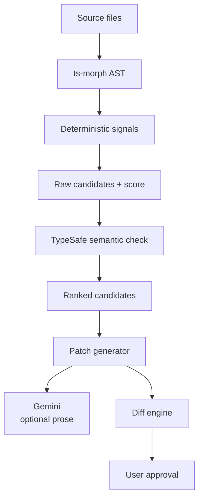

# JevX — v1 Blueprint

> ⚠️ **HISTORICAL — not current instructions.** The v1 text-matching → patch-generator plan. Its M4/M5 (suggest/diff/apply) are today's frozen M9+. The current architecture is [docs/CURRENT-ARCHITECTURE.md](./CURRENT-ARCHITECTURE.md); where they differ, that file wins.


## What JevX is

JevX is a CLI that finds hardcoded logic in a TypeScript/JavaScript codebase that is really doing semantic classification, and rewrites it as a real TypeSafe AI call — shown as a Cursor-style red/green diff you accept or reject.

The problem: codebases are full of branches like `if (message.includes("refund"))`. They look like logic, but they are a human judgment call frozen into string matching. They break on "money back" or "I want my payment returned". Nobody hunts for them, because each one looks fine on its own.

JevX hunts for them. It scans, scores, explains why a branch is brittle, generates the semantic replacement, and puts a reviewable patch in front of you.

Against a linter: a linter reports a broken rule. JevX proposes the actual fix, checks that the fix compiles and returns the expected shape, then asks for approval. Against Copilot: Copilot waits to be asked at a cursor. JevX sweeps the whole repo and ranks what it finds.

## Core pipeline

Nine stages, in order. Nothing else ships in v1 until every one of them works well.



| Stage | Job |
| --- | --- |
| Scan | Walk the repo, respect ignores, parse TS/JS into ASTs |
| Detect | Fire deterministic signals over the AST, collect raw candidates |
| Rank | Score 0–100, band them, sort, drop anything under the threshold |
| Explain | Say in plain words why this branch is brittle |
| Generate | Emit a real `@typesafe-ai/sdk` replacement for the branch |
| Diff | Render a unified red/green patch against the original file |
| Test | Typecheck the patched file, optionally run project tests |
| Apply | Git checkpoint, then write the patch to disk |
| Revert | Undo the last applied change from the checkpoint |

## Architecture and layer separation

Three layers, with a hard rule between them: **AST decides what is a candidate, TypeSafe decides whether it is semantically real, Gemini never decides anything.**



Why the rule matters: detection stays fast, reproducible, debuggable and cheap. The same repo scanned twice gives the same list. If Gemini sat in the detection path, the candidate list would drift between runs and nobody could trust the score.

Gemini is optional in a strict sense — JevX must work fully with it switched off. It writes human-readable explanations and can assist with rewrite wording. If AST plus TypeSafe can produce the patch alone, Gemini stays out of the path entirely.

## Repo structure

Monorepo from day one, so the detector and diff engine can be reused by the v2 extensions without a rewrite.

```
jevx/
├── apps/
│   └── cli/              # commands, arg parsing, wiring
├── packages/
│   ├── scanner/          # file walking, ignores, ts-morph project loading
│   ├── detector/         # signals, scoring, banding
│   ├── typesafe/         # @typesafe-ai/sdk adapter, semantic validation
│   ├── analyzer/         # explanations, optional Gemini adapter
│   ├── patcher/          # code generation, unified diff, git checkpoints
│   ├── validator/        # tsc check, output-shape check, test runner
│   └── terminal-ui/      # Ink components, screens, ASCII banner
├── tests/
├── examples/             # sample repos with known candidates
├── jevx.config.ts
├── package.json
└── README.md
```

| Package | Owns | Must not |
| --- | --- | --- |
| `scanner` | Walking files, applying ignores, building the ts-morph project | Know anything about candidates |
| `detector` | Signals, raw score, bands | Call any network API |
| `typesafe` | All SDK calls, semantic validation, confidence | Own the detection heuristics |
| `analyzer` | Explanations, Gemini adapter | Change whether something is a candidate |
| `patcher` | Code generation, unified diff, git checkpoint and revert | Decide correctness |
| `validator` | tsc, output-shape check, test runner | Modify files |
| `terminal-ui` | Every Ink component and screen | Contain business logic |

`examples/` matters more than it looks. Small repos with hand-labelled candidates become the detector's regression suite — that is how we tell whether a rubric change made detection better or worse.

## Detection and scoring

The rubric does not need to be right on day one. It needs to be **explicit, configurable, and measurable against `examples/`**. Signal weights live in config so they can be tuned without touching code.

Each signal fires or does not, contributes its weight, and the sum is clamped to 0–100.

| Signal | Starting weight |
| --- | --- |
| `.includes()` / `.startsWith()` / `.endsWith()` on human-text values | 25 |
| Regex matched against natural-language strings | 20 |
| Large keyword list (array or object of terms) | 20 |
| Three or more `if`/`else` branches keyed on text | 15 |
| `switch` over freeform text values | 15 |
| Normalization (`toLowerCase`, `trim`) followed by keyword matching | 10 |
| Fuzzy or string-similarity logic | 10 |
| Hardcoded intent or category labels (`"refund"`, `"support"`, `"spam"`) | 15 |

**Bands**

| Score | Band | Behaviour |
| --- | --- | --- |
| 0–49 | Ignore | Not shown |
| 50–74 | Possible | Shown, collapsed by default |
| 75–89 | Strong | Shown |
| 90+ | Very strong | Shown, highlighted |

The AST score is a shortlist, not a verdict. **Everything scoring 50 or above goes to TypeSafe for validation** — not just the strong band. A 60 on AST signals can come back at 92 once TypeSafe confirms the branch is genuinely semantic, and validating only 75+ would silently lose those. A `.includes()` check on an enum value or a file extension scores high on signals and gets thrown out at this step. The number shown in the CLI is always the post-validation confidence.

```
AST scan → raw candidates → drop <50 → TypeSafe validates all 50+ → final confidence
```

| Flag | Behaviour |
| --- | --- |
| `jevx scan` | Validates every candidate scoring 50+ |
| `jevx scan --no-validate` | Fast AST-only pass, shows preliminary scores |
| `jevx scan --validate-all` | Validates everything, including below 50 |

TypeSafe results are cached by `file hash + candidate hash`. An unchanged candidate never costs a second API call, which is what makes validating the whole 50+ band affordable on a large repo.

The honest open question is what "human text" means to a static analyzer. First pass: variable and parameter names (`message`, `text`, `query`, `body`, `comment`, `input`, `prompt`, `description`), plus string literals that contain spaces or are longer than one word. Crude, tunable, good enough to start.

## Generated code contract

No invented `jev(...)` function. Patches emit the documented `@typesafe-ai/sdk` pattern, so generated code compiles against the real SDK on day one.

**Before**

```ts
if (message.includes("refund")) {
  return refundFlow();
}
```

**After**

```ts
import { choice, TypeSafeClient } from "@typesafe-ai/sdk";

const client = new TypeSafeClient();

const result = await client.systemOne({
  state: { message },
  questions: {
    intent: choice("What is the message about?", {
      refund: "The user wants a refund",
      support: "The user needs support",
      other: "None of these"
    })
  }
});

if (result.answers.intent.choice === "refund") {
  return refundFlow();
}
```

What the generator has to get right:

1. Derive the option set from the branches it is replacing, always with an `other` escape hatch.
2. Write option descriptions that read as instructions to a model, not as labels.
3. Put the right variables into `state`.
4. Hoist the `import` and the client construction to the correct scope, without duplicating an existing client.
5. Make the enclosing function `async` if it is not already — and flag the call sites that now need `await`.

Point 5 is the sharpest edge. Turning a sync function async is a breaking change that ripples outward, and the diff has to show that honestly rather than quietly editing one file. A `jevx(...)` convenience wrapper over this pattern is a later idea, not v1.

## CLI surface

The CLI is the product, not a wrapper around it. Bare `jevx` opens the welcome screen and an interactive menu.

| Command | Does | In v1 |
| --- | --- | --- |
| `jevx scan` | Scan, score, display candidates | Yes — milestone 1 |
| `jevx inspect` | Interactive candidate explorer | Yes |
| `jevx explain <file:line>` | Why this is a candidate | Yes |
| `jevx suggest <file:line>` | Generate the TypeSafe implementation | Yes |
| `jevx diff <file:line>` | Show the red/green patch | Yes |
| `jevx apply <file:line>` | Checkpoint, validate, apply | Yes |
| `jevx revert` | Undo the last applied change | Yes |
| `jevx init` | Create `jevx.config.ts` | Yes |
| `jevx status` | Config state, last scan, funnel counters | Yes |
| `jevx check` | Verify config, keys, SDK reachability | Yes |
| `jevx watch` | Re-detect on file save | Later in v1 |
| `jevx test` | Run project tests against applied changes | Later in v1 |
| `jevx benchmark` | Compare original vs TypeSafe behaviour | v2 |
| `--help` `--commands` `--version` `--about` | Discovery | Yes |

`jevx scan` takes `--no-validate` (fast AST-only) and `--validate-all` (validate below 50 too). Default validates everything scoring 50+.

**Scan output**

```
╭──────────────────────────────────────╮
│        Welcome to JevX Scan          │
╰──────────────────────────────────────╯

  JJJJJ  EEEEE  V   V  X   X
    J    E       V V    X X
    J    EEEE     V      X
J   J    E       V V    X X
 JJJ     EEEEE  V   V  X   X

Scanning your codebase...

✓ 1,284 files analyzed
✓ 47 semantic decisions detected

⚡ 4 strong Jev candidates

  router.ts:42       87%
  auth.ts:91         81%
  parser.ts:18       74%
  support.ts:103     71%

↑/↓ Select   Enter Inspect   Q Quit
```

**Approval prompt**

Selecting a candidate shows the reason, then the patch as a true red/green unified diff, then:

```
Accept changes?  [y] Yes  [n] No  [d] View diff
```

Every interactive screen needs a non-interactive equivalent — `--json` output and a `--yes` flag — or JevX can never run in CI. Worth building in from the start rather than retrofitting.

## Config

`jevx.config.ts` at the project root, created by `jevx init`. Typed, so editing it has autocomplete.

```ts
import { defineConfig } from "jevx";

export default defineConfig({
  include: ["src/**/*.{ts,tsx,js,jsx}"],
  exclude: ["**/*.test.ts", "node_modules", "dist"],
  languages: ["typescript", "javascript"],

  thresholds: {
    minimum: 50,
    strong: 75,
    veryStrong: 90
  },

  signals: {
    stringIncludes: 25,
    regexOnText: 20,
    keywordList: 20,
    textBranches: 15,
    switchOnText: 15,
    normalizeThenMatch: 10,
    fuzzyMatch: 10,
    hardcodedLabels: 15
  },

  typesafe: { apiKey: process.env.TYPESAFE_API_KEY },
  gemini:   { enabled: false, apiKey: process.env.GEMINI_API_KEY },

  safety: {
    gitCheckpoint: true,
    checkpointMode: "branch",
    typecheckAfterApply: true,
    testCommand: "npm test"
  }
});
```

Keys are read from the environment, never written into the config file. `jevx init` should say so plainly when it scaffolds.

## Safety, validation and metrics

JevX edits people's source code. Every safeguard here is non-negotiable.

**Before apply**

1. Refuse to run if the working tree is dirty, unless `--force`.
2. Create a Git checkpoint — a branch or a stash, per `checkpointMode`.
3. Validate the generated code: it parses, it typechecks, the `import` resolves, and `result.answers.<name>.choice` matches the option keys the patch declared.
4. Reject the patch outright if any of that fails. A bad patch never reaches the diff screen.

**After apply**

1. Typecheck the project.
2. Run `testCommand` if configured.
3. On failure, offer immediate revert from the checkpoint.

`jevx revert` restores from the checkpoint. It is a first-class command, not a flag.

**Metrics**

A local funnel, written to `.jevx/metrics.json`, shown by `jevx status`:

```
candidates found → accepted → rejected → applied → reverted
```

The number that actually matters is the rejection rate per signal. If `fuzzyMatch` produces 90% rejections, that weight is wrong, and the funnel is what tells us. Local and private in v1 — no telemetry leaves the machine.

## Tech stack

| Layer | Technology |
| --- | --- |
| CLI runtime | TypeScript + Node.js |
| Terminal UI | Ink + React |
| Code parsing | ts-morph |
| Semantic reasoning | TypeSafe AI SDK (`@typesafe-ai/sdk`) |
| Explanations (optional) | Gemini API |
| Code edits | Unified diff / patch engine |
| Safety | Git |
| Config | `jevx.config.ts` |
| Validation | TypeScript compiler + project test runner |
| Build | tsup |
| Unit tests | Vitest |
| CLI tests | execa |
| Lint / format | ESLint + Prettier |
| Distribution | npm (`npm install -g jevx`) |

Everything here runs locally. No account, no auth, no network beyond the TypeSafe and Gemini calls.

## Milestones

Each milestone has to prove something before the next one starts. The rule behind the ordering: never build a beautiful CLI around a weak detector.

| # | Milestone | Proves |
| --- | --- | --- |
| M1 | AST scanner + preliminary scoring | Scans a real TS/JS repo, detects, scores, displays it beautifully |
| M2 | Detector quality + regression suite | Scores match hand-labelled `examples/`; stops flagging normal code |
| M3 | TypeSafe validation + final confidence | Semantic check removes false positives; the number shown is trustworthy |
| M4 | Generate + diff | Real SDK patches, compile-checked, rendered as red/green |
| M5 | Apply + revert | Git checkpoint, typecheck, tests, clean undo |

**M1 is the only thing being built right now.** Scaffold the monorepo, get scan working against a real codebase, ship the rubric as a first draft and tune it while the detector is live.

During M1 and M2 the CLI shows the **preliminary AST score**, labelled as such — it must not present an unvalidated number as final confidence. Final confidence only exists from M3, once TypeSafe is in the path. No `apply`, no Gemini, no rewriting until scan is genuinely good.

A note on M2: it is tempting to skip, because M1 looks finished and M4 is the exciting part. Skipping it means generating patches for candidates that were never real — which is the single most expensive failure mode this product has.

## Deferred to v2 and beyond

None of this is in v1. Listed so the v1 architecture leaves room for it.

| Item | Tech | Why deferred |
| --- | --- | --- |
| Multi-language support | Tree-sitter | TS/JS first; the detector interface should be language-agnostic so this drops in |
| Cloud dashboard | Next.js | Nothing to show until the CLI works |
| Auth | Clerk | Local CLI must never require a login to scan |
| Storage | PostgreSQL + Drizzle | Only needed once history is shared |
| GitHub PR integration | GitHub App / API | Reuses the same detection and diff engine |
| Browser extension | TypeScript + Plasmo | Same engine again |
| `jevx benchmark` | — | Needs applied changes in the wild to compare against |

**Ecosystem plan**

Repo now, private, while the detector and TypeSafe integration are figured out. That gives a real commit history instead of one enormous public dump later. Public once the core works and the API terms are clear — MIT or Apache-2.0, npm package, then `jevx.dev` as the landing page pointing at GitHub, docs, and a demo.

The package boundaries in this blueprint are what make outside contribution possible later: someone can add a detector signal or a language without understanding the diff engine.

## Open questions and risks

**TypeSafe early-access terms.** The agreement may restrict using the service or its output to build a similar or competing product. This does not block building or using JevX privately, but it needs reading before anything ships publicly. Worth resolving early — it could affect licensing and whether the repo goes public at all.

**Async propagation.** Replacing a sync branch with an `await` changes the enclosing function's signature and every call site. The diff has to surface this, not hide it. Possibly the hardest correctness problem in the whole product.

**What counts as human text.** The starting heuristic is crude. Only real usage against `examples/` will tell us how crude.

**Cost and latency of validation.** Validating the whole 50+ band on a large repo means many TypeSafe calls. Mitigated by caching on `file hash + candidate hash`, so only changed candidates are re-validated, plus `--no-validate` for a fast pass. Whether that is enough on a very large first scan is still unknown.

**Unresolved**

- [ ] Read the TypeSafe early-access agreement
- [ ] Decide `checkpointMode` default — branch or stash
- [ ] Pick the diff library

Decided since first draft: scan validates everything 50+, not just the strong band, with cache-by-hash to keep the cost down.
